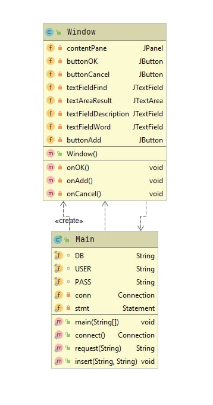
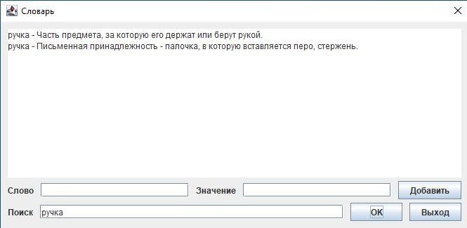
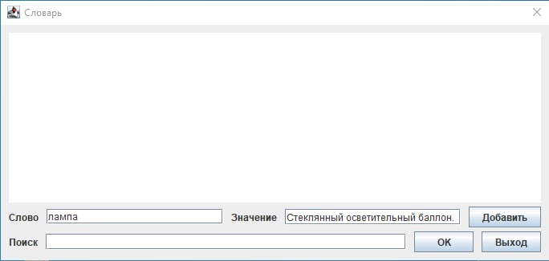

# Словарь
## Постановка задачи
Поиск по строке статей(может быть несколько определений одного понятия) в словаре.
### Дополнительное задание
+ возможность добаления словарных статей.
+ словарь содержится в таблице в PostgerSQL, доступ по JDBC.
## Описание архитектуры приложения
UML диаграмма классов: 
## Результаты работы приложения
Поиск: 

Добавление: 

## Использованные технологии
- GUI: Swing
## Вывод
Таким образом, было реализовано приложение для поиска словарных статей.
Для хранения статей используется PostgerSQL. 
Имеется возможность добавления новых словарных статей.
